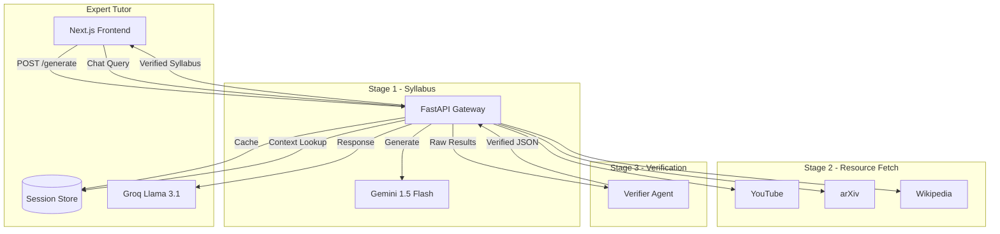

# 🚀 SmartTutor: Course Builder & Personal Tutor

A lightweight, synchronous agentic course compiler that automatically constructs structured learning syllabi, retrieves targeted reference videos and papers, filters them using a Verifier Agent, and hosts an interactive expert tutoring chat dashboard.

---

## 📐 System Architecture

SmartTutor uses a simplified, high-performance synchronous agentic pipeline that eliminates container overhead (no Docker, Kafka, Redis, or local vector DB indexing required):



---

## ⚡ Core Technology Stack

* **Frontend:** Next.js, React, TypeScript, Chart.js, TailwindCSS.
* **API Gateway:** FastAPI (Python), Pydantic.
* **LLM Engine:** Gemini 1.5 Flash (syllabus query compilation) & Groq Llama 3.1 8B (verifier agent and chat tutor).
* **RAG Strategy:** Memory-safe in-context context stuffing (no heavy FAISS vector files on disk).
* **Scraping & Ingestion:** BeautifulSoup4, aiohttp, requests.

---

## 🛠️ Installation & Setup

### 1. Configure API Keys
Create a `.env` file inside `smart-tutor-backend` containing your credentials:
```env
GEMINI_API_KEY=your_gemini_api_key_here
GROQ_API_KEY=your_groq_api_key_here
```

### 2. Configure the Python Backend
Activate your local virtual environment and install dependencies:
```bash
cd smart-tutor-backend
# Activate your environment
source Scripts/activate  # Windows PowerShell/Cmd
pip install -r requirements.txt
```

Launch the FastAPI web server:
```bash
python -m uvicorn src.main:app --host 127.0.0.1 --port 8000
```

### 3. Run the Frontend App
Install Node modules and start the Next.js development server:
```bash
cd smart-tutor
npm install
npm run dev
```

Open [http://localhost:3000](http://localhost:3000) to access the learning client.