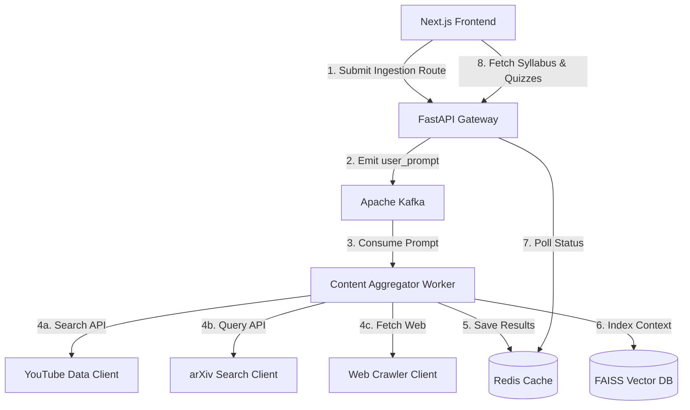

# 🚀 SmartTutor: AI-Powered Course Builder

An event-driven, RAG-enabled tutoring application that automatically constructs dynamic courses, syndicates academic papers, pulls video lectures, and creates interactive quizzes from simple topic prompts.

---

## 📐 System Architecture

SmartTutor is architected as an asynchronous, distributed event-driven application using a microservices-inspired Python backend and a modern Next.js frontend:



---

## ⚡ Core Technology Stack

* **Frontend:** Next.js, React, TypeScript, Chart.js, TailwindCSS.
* **API Gateway:** FastAPI (Python), Pydantic.
* **Message Broker:** Apache Kafka (asynchronous event ingestion and pipeline processing).
* **Caching & State:** Redis (in-memory request caching and status tracking).
* **Embeddings & Vector Search:** LangChain, SentenceTransformers (`all-MiniLM-L6-v2`), FAISS (Facebook AI Similarity Search).
* **Scraping & Ingestion:** BeautifulSoup4, aiohttp, PyPDF2, pdfplumber.

---

## 📂 Repository Structure

```text
AI-Powered-Course-Builder/
├── smart-tutor/               # Next.js React Frontend App
│   ├── public/                # Static assets & media
│   ├── src/
│   │   ├── app/               # Next.js Router pages (content, quiz, performance)
│   │   ├── components/        # Sidebar, ContentCard, QuizForm, PerformanceChart
│   │   └── styles/            # Global stylesheets
│   ├── package.json
│   └── tsconfig.json
│
└── smart-tutor-backend/       # FastAPI Python Backend App
    ├── data/                  # Vector Store Index storage
    ├── docs/                  # Architecture schemas & notes
    ├── src/
    │   ├── api/               # API Controllers & routes
    │   ├── config/            # System configuration settings
    │   ├── models/            # Pydantic validation schemas
    │   ├── services/          # LLM orchestration, Kafka, VectorDB, Redis services
    │   └── utils/             # Helper utilities (embeddings, parsing)
    ├── tests/                 # Backend testing harness
    ├── consumer.py            # Local Kafka event consumer demo
    ├── docker-compose.yml     # Local services container orchestration (Kafka, Redis)
    └── requirements.txt       # Python backend dependencies
```

---

## 🛠️ Installation & Setup

### 1. Spin up Core Infrastructure Services
Launch Redis and Apache Kafka local containers:
```bash
cd smart-tutor-backend
docker-compose up -d
```

### 2. Configure the Python Backend
Create a virtual environment and install the required machine learning and web dependencies:
```bash
cd smart-tutor-backend
python -m venv .venv
source .venv/Scripts/activate  # On Windows
pip install -r requirements.txt
```

Launch the FastAPI web server:
```bash
uvicorn src.main:app --reload --port 8000
```

Run the background content aggregator:
```bash
python -m src.services.contentAggregator
```

### 3. Run the Frontend App
Install Node modules and start the Next.js development server:
```bash
cd smart-tutor
npm install
npm run dev
```
Open [http://localhost:3000](http://localhost:3000) to access the visual learning client.